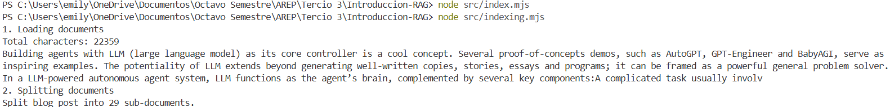
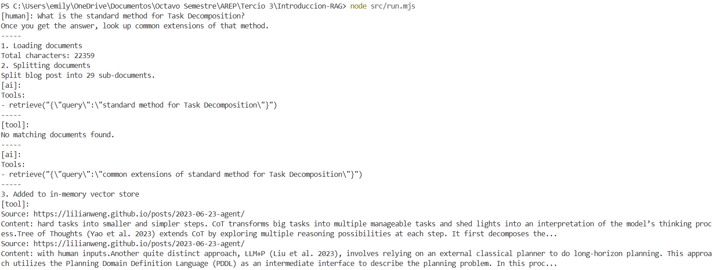
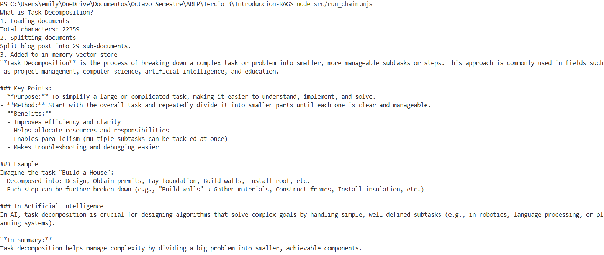

# Introducción a RAG con LangChain + OpenAI
### Emily Noreña Cardozo

Este proyecto demuestra dos enfoques de Retrieval-Augmented Generation (RAG) utilizando LangChain y la API de OpenAI:

1. **Agentic RAG (dinámico):** El modelo decide cuándo y cómo usar la herramienta de búsqueda (`retrieve`).
2. **Two-Step RAG (determinista):** Siempre realiza una búsqueda antes de responder, en una sola pasada.

---

## Arquitectura del proyecto


La arquitectura se compone de:

```
src/
├── index.mjs #Inicializa el modelo y las embeddings
├── indexing.mjs #Descarga, fragmenta y vectoriza el documento fuente
├── retrieve.mjs #Define la herramienta de recuperación ("retrieve")
├── run.mjs #Ejecución del flujo Agentic RAG
├── run_chain.mjs #Ejecución del flujo RAG Chain
```


### Componentes principales

| Componente | Descripción |
|-------------|--------------|
| **CheerioWebBaseLoader** | Descarga el contenido HTML desde una URL y lo limpia (extrae `<p>`). |
| **RecursiveCharacterTextSplitter** | Divide el texto largo en fragmentos (chunks) de 1000 caracteres. |
| **HNSWLib VectorStore** | Motor de búsqueda semántica basado en embeddings. |
| **LangChain Tools** | Define el `tool retrieve` usado por el agente para acceder al vector store. |
| **createAgent** | Permite construir un agente LLM con o sin herramientas de búsqueda. |
| **dynamicSystemPromptMiddleware** | Inserta contexto dinámico en el prompt (en el enfoque determinista). |

---

## Instalación

1. Clonar el proyecto
2. Crear un entorno Node: `npm init -y`
3. Instalar dependencias: `npm install @langchain/openai @langchain/community @langchain/core @langchain/textsplitters hnswlib-node cheerio zod dotenv`
4. Configurar la API Key de OpenAI en el archivo .env

---

## Ejecución

1. Indexar el documento: `node src/indexing.mjs`. Esto descarga el artículo base y genera el índice vectorial.

2. Ejecutar el flujo Agentic RAG: `node src/run.mjs`

3. Ejecutar el flujo RAG Chain: `node src/run_chain.mjs`


---

## Diferencias entre los dos enfoques

| Aspecto                  | Agentic RAG       | RAG Chain            |
| ------------------------ | -------------------- | -------------------------- |
| Búsqueda controlada por  | El LLM (autónomo)    | El pipeline (determinista) |
| Nº de búsquedas          | Múltiples            | Una sola                   |
| Flexibilidad             | Alta                 | Media                      |
| Latencia                 | Mayor                | Menor                      |
| Ideal para               | Agentes interactivos | Consultas rápidas tipo QA  |
